# Bilangan Prima dengan Do-While Loop

<div align="center">


**Program Java untuk menampilkan bilangan prima 1-1000 menggunakan nested do-while loops dengan eksekusi terjamin**

[Keunikan](#-keunikan) • [Implementasi](#-implementasi) • [Analisis](#-analisis) • [Aplikasi](#-aplikasi)

</div>

## 📋 Daftar Isi

- [Gambaran Umum](#-gambaran-umum)
- [Keunikan](#-keunikan)
- [Analisis](#-analisis)
- [Aplikasi](#-aplikasi)
- [Kelebihan](#-kelebihan)
- [Penggunaan](#-penggunaan)

## 🚀 Gambaran Umum

Program ini mengimplementasikan deteksi bilangan prima menggunakan nested do-while loops. Do-while memastikan setiap loop dieksekusi minimal sekali sebelum pengecekan kondisi, cocok untuk skenario yang membutuhkan eksekusi terjamin.

### ✨ Highlights

- 🔁 **Eksekusi Terjamin** - Minimal satu eksekusi per loop
- 🎯 **Deteksi Bilangan Prima** - Identifikasi bilangan prima 2-1000
- ⚡ **Pengecekan Teroptimasi** - Menggunakan √n untuk efisiensi
- 🔄 **Do-While Bersarang** - Do-while dalam do-while

## 🔁 Keunikan

### Karakteristik Do-While Loop

1. **Eksekusi Dulu**: Blok kode dieksekusi sebelum pengecekan kondisi
2. **Lalu Cek**: Kondisi dievaluasi setelah eksekusi
3. **Minimal Satu**: Terjamin setidaknya satu eksekusi
4. **Lanjut Jika True**: Ulangi jika kondisi terpenuhi

### Mengapa Do-While untuk Pengecekan Prima?
- **Angka 2**: Harus dicek (prima terkecil)
- **Kasus Batas**: Tangani kasus edge dengan andal
- **Perilaku Konsisten**: Alur eksekusi yang dapat diprediksi

### Detail Implementasi Kunci

1. **Do-While Luar**: Iterasi melalui angka 2-1000
2. **Do-While Dalam**: Cek keterbagian dari 2 sampai √i
3. **Kondisi Break**: Penghentian dini ketika pembagi ditemukan
4. **Penanganan Batas**: Penanganan khusus untuk angka 2

## 🏗️ Struktur Program

### Alur Program

```mermaid
graph TD
    A[Mulai] --> B[Cetak Header]
    B --> C[Inisialisasi i=2]
    C --> D[Do Loop Luar]
    D --> E[Set isPrima=true]
    E --> F[Inisialisasi j=2]
    F --> G[Do Loop Dalam]
    G --> H{j > √i?}
    H -- Ya --> I[Break loop dalam]
    H -- Tidak --> J{i % j == 0?}
    J -- Ya --> K[Set isPrima=false]
    K --> L[Break loop dalam]
    J -- Tidak --> M[Increment j++]
    M --> N{while j <= √i?}
    N -- Ya --> G
    N -- Tidak --> O[while loop dalam selesai]
    L --> O
    I --> O
    O --> P{isPrima true?}
    P -- Ya --> Q[Cetak i]
    P -- Tidak --> R[Increment i++]
    Q --> R
    R --> S{while i <= 1000?}
    S -- Ya --> D
    S -- Tidak --> T[Selesai]
```


## 📊 Analisis

### Jaminan Eksekusi

| Angka | Loop Luar | Loop Dalam | Terjamin? |
|-------|-----------|------------|-----------|
| 2 | Ya | Ya | Keduanya terjamin |
| 3 | Ya | Ya | Keduanya terjamin |
| 4 | Ya | Ya | Keduanya terjamin |

### Karakteristik Performa
- **Kasus Terburuk**: O(n√n) - sama dengan pendekatan lain
- **Kasus Terbaik**: O(n) - untuk banyak bilangan komposit
- **Memori**: O(1) - penggunaan variabel minimal

## 🎮 Penggunaan

### Kompilasi
```bash
javac PrimaDoWhile.java
```

### Eksekusi
```bash
java While_Bilangan_Prima_Antara_1_Sampai_1000.PrimaDoWhile
```

### Output yang Diharapkan
```
Bilangan prima antara 1-1000 : 
2 3 5 7 11 13 17 19 23 29 31 37 41 43 47 53 59 61 67 71 73 79 83 89 97 ...
... 977 983 991 997
```

## 🎯 Aplikasi

### Kasus Penggunaan Ideal

1. **Sistem Menu** - Selalu tampilkan menu sekali
2. **Validasi Input** - Dapatkan input minimal sekali
3. **Inisialisasi** - Harus jalankan setup sekali
4. **Loop Game** - Selalu proses satu frame

### Aplikasi Khusus Bilangan Prima
- **Kriptografi** - Generasi bilangan prima
- **Pengujian Algoritma** - Algoritma deteksi prima
- **Pendidikan Matematika** - Demonstrasi bilangan prima

## 💪 Kelebihan

### ✅ Manfaat Keandalan
- **Eksekusi Terjamin** - Tidak ada skip karena kondisi awal
- **Dapat Diprediksi** - Perilaku konsisten antar eksekusi
- **Kokoh** - Menangani kasus edge secara efektif

### ✅ Manfaat Edukasional
- **Pemahaman Loop** - Pemahaman mendalam tentang do-while
- **Desain Algoritma** - Penguasaan algoritma deteksi prima
- **Logika Kondisi** - Keterampilan penanganan kondisi kompleks

### ✅ Manfaat Praktis
- **Antarmuka Pengguna** - Render UI yang andal
- **Layanan Sistem** - Eksekusi service yang terjamin
- **Pengembangan Game** - Eksekusi game loop yang konsisten
- **Sistem Embedded** - Inisialisasi perangkat keras

### ✅ Perbandingan dengan Loop Lain
| Aspek | Do-While | While | For |
|-------|----------|-------|-----|
| **Eksekusi Pertama** | Terjamin | Bersyarat | Bersyarat |
| **Readability** | Sedang | Tinggi | Tinggi |
| **Kontrol** | Tinggi | Tinggi | Sedang |
| **Kasus Khusus** | Menu, Input | Umum | Counter |

</div>