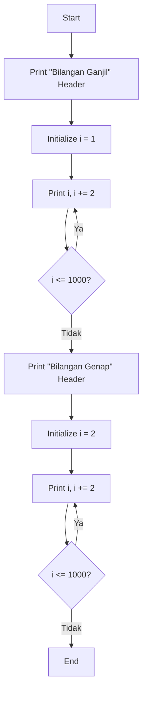

# Bilangan Ganjil dan Genap dengan Do-While Loop

<div align="center">


**Program Java untuk menampilkan bilangan ganjil dan genap 1-1000 menggunakan perulangan do-while**

[Fitur](#-fitur) • [Cara Kerja](#-cara-kerja) • [Keunikan](#-keunikan)

</div>

## 📋 Daftar Isi

- [Gambaran Umum](#-gambaran-umum)
- [Fitur](#-fitur)
- [Cara Kerja](#-cara-kerja)
- [Penggunaan](#-penggunaan)
- [Keunikan](#-keunikan)
- [Kelebihan](#-kelebihan)

## 🚀 Gambaran Umum

Program ini menampilkan deretan bilangan ganjil dan genap dalam rentang 1 sampai 1000 menggunakan perulangan `do-while`. Do-while memastikan eksekusi minimal satu kali sebelum pengecekan kondisi.

### ✨ Highlights

- 🔁 **Perulangan Do-While** - Eksekusi minimal sekali
- 🔢 **Proses Berurutan** - Ganjil lalu genap
- ⚡ **Iterasi Optimal** - Penambahan 2
- 🎯 **Eksekusi Terjamin** - Pasti dieksekusi sekali

## 🌟 Fitur

### 🔧 Fitur Inti
- **Struktur Do-While** - Eksekusi dulu, cek kondisi kemudian
- **Pemrosesan Dua Fase** - Ganjil kemudian genap secara berurutan
- **Daur Ulang Variabel** - Penggunaan memori efisien
- **Jaminan Kondisional** - Eksekusi minimal satu kali

### 📊 Fitur Output
- **Output Terformat** - Header bagian yang jelas
- **Pemisah Spasi** - Urutan angka yang mudah dibaca
- **Pemisah Baris** - Pemisahan bagian yang tepat

## 🔍 Cara Kerja

### Alur Program


## 🎮 Penggunaan

### Perintah Kompilasi
```bash
javac GanjilGenapDoWhile.java
```

### Perintah Eksekusi
```bash
java Do_while_Bilangan_Ganjil_Genap_1_Sampai_1000.GanjilGenapDoWhile
```

### Perilaku yang Diharapkan
1. **Kompilasi Sukses**: Tidak ada error sintaks
2. **Runtime**: Eksekusi langsung
3. **Output**: Penampilan angka berurutan

## 📊 Output

### Output yang Diharapkan
```
Bilangan ganjil antara 1-1000 : 
1 3 5 7 9 11 ... 997 999 

Bilangan genap antara 1-1000 : 
2 4 6 8 10 12 ... 998 1000 
```

### Analisis Output
- **Bagian Ganjil**: 1 sampai 999, hanya bilangan ganjil
- **Bagian Genap**: 2 sampai 1000, hanya bilangan genap
- **Total Angka**: 1000 angka diproses
- **Jumlah Ganjil**: 500 bilangan
- **Jumlah Genap**: 500 bilangan

## 🔄 Keunikan

### Perbandingan Do-While dengan Loop Lain

| Fitur | Do-While | While | For |
|-------|----------|-------|-----|
| **Eksekusi Pertama** | Terjamin | Bersyarat | Bersyarat |
| **Pengecekan Kondisi** | Setelah eksekusi | Sebelum eksekusi | Sebelum eksekusi |
| **Kasus Penggunaan** | Sistem menu | Tujuan umum | Berbasis counter |

### Kapan Menggunakan Do-While
- **Sistem Menu** - selalu tampilkan menu sekali
- **Input Pengguna** - dapatkan input minimal sekali
- **Setup Awal** - harus jalankan setup sekali
- **Validasi Data** - proses data minimal sekali

## 💪 Kelebihan

### ✅ Keandalan
- **Eksekusi Terjamin** - berjalan minimal sekali
- **Dapat Diprediksi** - perilaku konsisten
- **Kokoh** - menangani kasus edge dengan baik

### ✅ Nilai Edukasional
- **Pemahaman Loop** - memperdalam pemahaman perulangan
- **Penguasaan Kondisi** - mengajarkan logika kondisional
- **Kontrol Alur** - meningkatkan pemahaman alur program

### ✅ Aplikasi Praktis
- **Antarmuka Pengguna** - tampilan menu
- **Pengembangan Game** - loop game
- **Layanan Sistem** - pengecekan service
- **Pemrosesan Data** - iterasi data wajib

### ✅ Efisiensi
- **Kompleksitas Waktu**: O(n) untuk setiap sequence
- **Kompleksitas Memori**: O(1) - hanya variabel sederhana
- **Optimasi**: Increment 2 mengurangi iterasi separuh

---

<div align="center">

## 🎯 Kesimpulan

**Do-while loop adalah pilihan tepat ketika Anda membutuhkan eksekusi pertama yang terjamin!**

**Selamat Mencoba! 🚀**

</div>