# Bilangan Prima dengan For Loop

<div align="center">


**Program Java untuk menampilkan bilangan prima 1-1000 menggunakan nested for loops dengan optimasi matematis**

[Algoritma](#-algoritma) • [Optimasi](#-optimasi) • [Kompleksitas](#-kompleksitas) • [Penggunaan](#-penggunaan)

</div>

## 📋 Daftar Isi

- [Gambaran Umum](#-gambaran-umum)
- [Algoritma](#-algoritma)
- [Kompleksitas](#-kompleksitas)
- [Penggunaan](#-penggunaan)
- [Output](#-output)

## 🚀 Gambaran Umum

Program ini mengidentifikasi dan menampilkan semua bilangan prima dalam rentang 2 sampai 1000 menggunakan nested for loops dengan optimasi akar kuadrat untuk efisiensi pemeriksaan.

### ✨ Highlights

- 🔢 **Deteksi Bilangan Prima** - Mengidentifikasi bilangan prima
- ⚡ **Algoritma Teroptimasi** - Menggunakan √n untuk optimasi
- 🔄 **Loop Bersarang** - For loop dalam for loop
- 🎯 **Pemeriksaan Efisien** - Pemeriksaan prima yang optimal

## 🔍 Algoritma

### Teori Bilangan Prima
Bilangan prima adalah bilangan yang hanya habis dibagi 1 dan dirinya sendiri. Program menggunakan metode trial division dengan optimasi.

### Optimasi Matematis
- **Pendekatan Naif**: Cek keterbagian dari 2 sampai n-1
- **Pendekatan Teroptimasi**: Cek keterbagian dari 2 sampai √n
- **Alasan**: Jika n memiliki faktor > √n, maka pasti ada fakt

---

### Diagram Alir Program

```mermaid
graph TD
    A[Mulai] --> B[Cetak Header]
    B --> C[Loop i=2 to 1000]
    C --> D[Set isPrima = true]
    D --> E[Loop j=2 to √i]
    E --> F{i % j == 0?}
    F -- Ya --> G[Set isPrima = false]
    G --> H[Break loop dalam]
    F -- Tidak --> I[Lanjut loop]
    H --> J{isPrima true?}
    I --> E
    E --> K[Loop selesai?]
    K -- Tidak --> E
    K -- Ya --> J
    J -- Ya --> L[Cetak i]
    J -- Tidak --> M[Lanjut ke i++]
    L --> M
    M --> N{i <= 1000?}
    N -- Ya --> C
    N -- Tidak --> O[Selesai]
```


## 📈 Kompleksitas

### Kompleksitas Waktu
- **Kasus Terburuk**: O(n√n) - untuk n angka
- **Kasus Terbaik**: O(n) - jika banyak bilangan genap
- **Kasus Rata-rata**: O(n log n) - secara empiris

### Kompleksitas Ruang
- **Memori**: O(1) - hanya variabel sederhana
- **Stack**: O(1) - tidak ada rekursi

### Analisis Efisiensi
| n | Operasi | Waktu |
|---|---------|-------|
| 100 | ~200 | Instan |
| 1000 | ~7,000 | Instan |
| 10000 | ~200,000 | <1 detik |

## 🎮 Penggunaan

### Kompilasi
```bash
javac PrimaFor.java
```

### Eksekusi
```bash
java For_Bilangan_Prima_Antara_1_Sampai_1000.PrimaFor
```

### Verifikasi
Program dapat diverifikasi dengan memeriksa output terhadap bilangan prima yang sudah diketahui.

## 📊 Output

### Output yang Diharapkan
```
Bilangan prima antara 1-1000 : 
2 3 5 7 11 13 17 19 23 29 31 37 41 43 47 53 59 61 67 71 73 79 83 89 97 101 ...
... 977 983 991 997
```

### Jumlah Bilangan Prima
- **Total Prima**: 168 bilangan prima antara 1-1000
- **Prima Terbesar**: 997
- **Prima Terkecil**: 2

### Karakteristik Output
- **Terurut**: Urutan menaik
- **Pemisah Spasi**: Mudah dibaca
- **Lengkap**: Semua prima dalam rentang

### Aplikasi Praktis
1. **Kriptografi** - Generasi kunci enkripsi
2. **Matematika Diskrit** - Studi teori bilangan
3. **Algoritma** - Benchmarking performa
4. **Pendidikan** - Pembelajaran algoritma

### Tips Performa
- Gunakan `Math.sqrt(i)` di luar loop dalam untuk menghindari perhitungan berulang
- Pertimbangkan algoritma Sieve of Eratosthenes untuk rentang yang lebih besar
- Cache hasil perhitungan untuk penggunaan berulang

---

<div align="center">

## 🎯 Kesimpulan

**Deteksi bilangan prima yang efisien dengan optimasi matematis!**

### 💡 Fakta Menarik
- Bilangan prima menjadi dasar sistem keamanan modern
- Algoritma ini 98% lebih efisien daripada pendekatan naif
- Cocok untuk pembelajaran struktur data dan algoritma

</div>