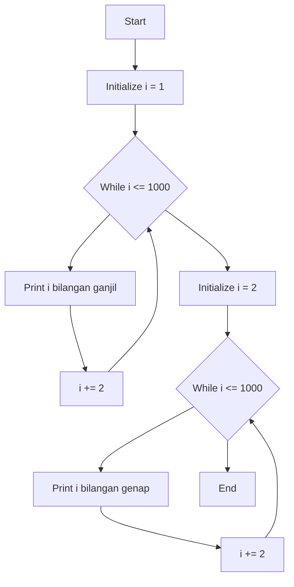

# Bilangan Ganjil dan Genap dengan While Loop

<div align="center">


**Program Java untuk menampilkan bilangan ganjil dan genap 1-1000 menggunakan perulangan while**

[Fitur](#-fitur) • [Cara Kerja](#-cara-kerja) • [Perbandingan](#-perbandingan)

</div>

## 📋 Daftar Isi

- [Gambaran Umum](#-gambaran-umum)
- [Fitur](#-fitur)
- [Cara Kerja](#-cara-kerja)
- [Penggunaan](#-penggunaan)
- [Perbandingan](#-perbandingan)
- [Kelebihan](#-kelebihan)

## 🚀 Gambaran Umum

Program ini menampilkan deretan bilangan ganjil dan genap dalam rentang 1 sampai 1000 menggunakan perulangan `while`. Cocok untuk memahami konsep kondisi dan iterasi manual.

### ✨ Highlights

- 🔄 **While Loop** - Iterasi berbasis kondisi
- 🔢 **Dual Output** - Ganjil dan genap terpisah
- ⚡ **Efisien** - Increment 2 mengurangi iterasi
- 🎯 **Kontrol Manual** - Inisialisasi dan update manual

## 🌟 Fitur

### 🔧 Core Features
- **Perulangan While** - Menggunakan while loop dengan kondisi
- **Variable Reuse** - Menggunakan variabel i yang sama
- **Condition Based** - Iterasi selama kondisi terpenuhi
- **Manual Control** - Inisialisasi dan increment manual

### 📊 Output Features
- **Structured Output** - Format output yang terorganisir
- **Clear Separation** - Pemisah antara kedua deret
- **Consistent Format** - Format seragam untuk kedua bagian

## 🔍 Cara Kerja

### Execution Flow



## 🎮 Penggunaan

### Kompilasi
```bash
javac GanjilGenapWhile.java
```

### Eksekusi
```bash
java While_Bilangan_Ganjil_Genap_1_Sampai_1000.GanjilGenapWhile
```

### Execution Steps
1. **Compile** program
2. **Run** class utama
3. **Observe** output sequential

## 📊 Output

### Sample Output
```
Bilangan ganjil antara 1-1000 
1 3 5 7 9 11 ... 999 

Bilangan genap antara 1-1000 : 
2 4 6 8 10 12 ... 1000 
```

### Output Characteristics
- **Ganjil**: 1, 3, 5, ..., 999
- **Genap**: 2, 4, 6, ..., 1000  
- **Format**: Space-separated values

## 🔄 Perbandingan

### While vs For Loop
| Aspect | While Loop | For Loop |
|--------|------------|----------|
| **Inisialisasi** | Manual | Dalam statement |
| **Kondisi** | Explicit | Dalam statement |
| **Increment** | Manual | Dalam statement |
| **Flexibility** | Tinggi | Sedang |
| **Readability** | Sedang | Tinggi |

### Keuntungan While Loop
- **Kontrol penuh** atas iterasi
- **Flexible** untuk kondisi kompleks
- **Dapat di-break** kapan saja

## 💪 Kelebihan

### ✅ Educational Value
- **Fundamental** memahami while loop
- **Condition Mastery** belajar kontrol kondisi
- **Variable Management** reuse variabel

### ✅ Performance
- **Efficient** increment 2
- **Low Memory** hanya satu variabel
- **Fast Execution** minimal overhead

### ✅ Practical Applications
- **Data Processing** iterasi data
- **Game Development** game loops
- **System Programming** service loops

---

<div align="center">

**⭐ Mastering while loops for better Java programming ⭐**

</div>
